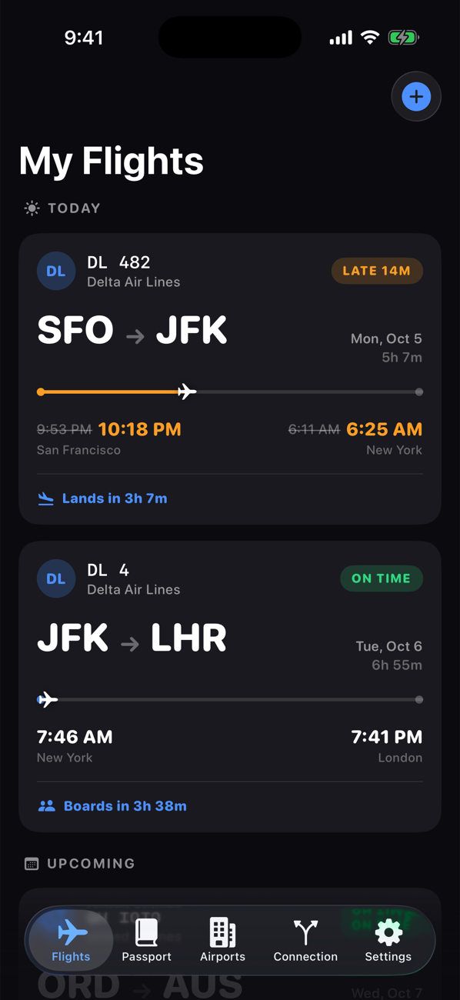
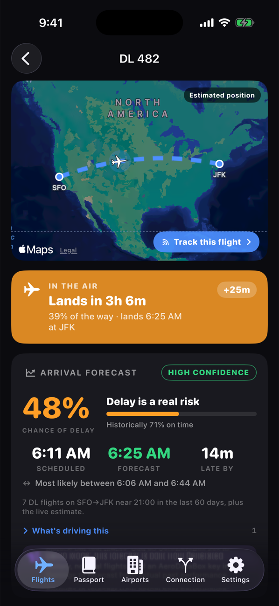
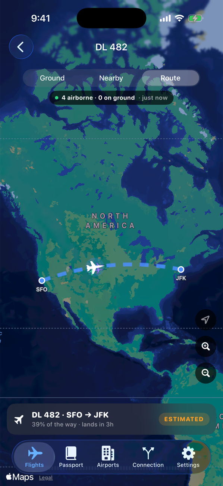
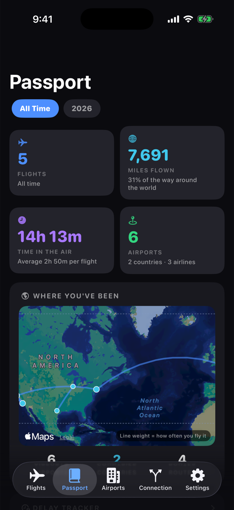
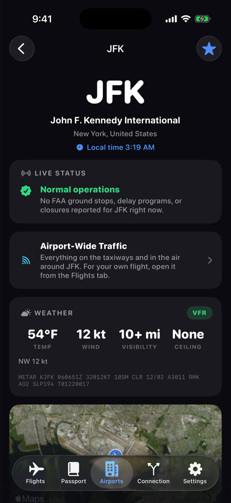
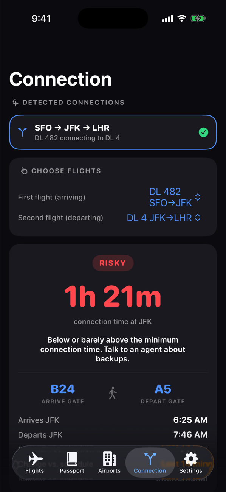
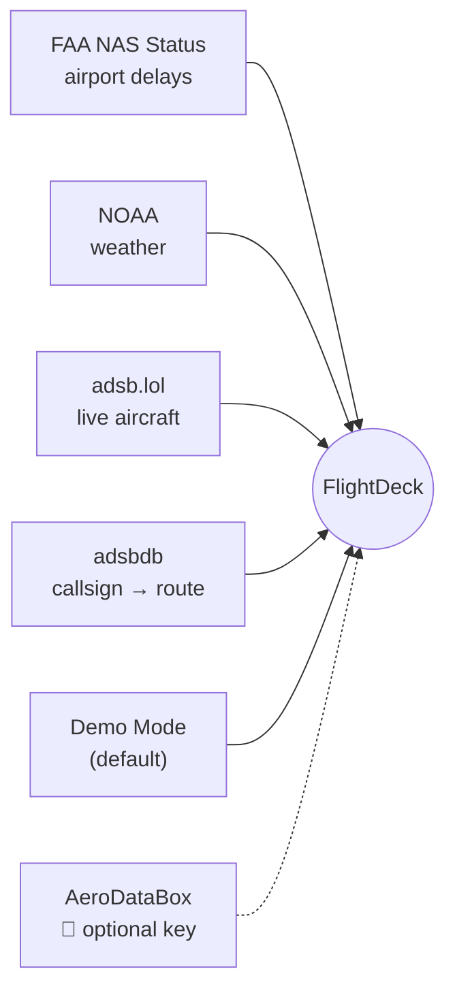

<div align="center">


# FlightDeck

**A personal flight tracker for iPhone — live tracking, delay forecasts, and a lifetime Passport.**


<br />


&nbsp;

&nbsp;


</div>

<br />

No accounts, no subscription, no backend. Open the project, press Run, and it
works — Demo Mode gives you a live sample trip straight away.

> Inspired by [Flighty](https://flighty.com), which is excellent — go buy it.
> FlightDeck is an original personal-use app and contains no Flighty code or artwork.

---

## What it does

<table>
<tr>
<td width="34%"></td>
<td>

### ✈️ My Flights

- Flight cards with a live progress bar and status pill
- Delays shown as ~~old time~~ **new time**, in the *airport's* timezone
- Countdown to the next thing: boarding, gate close, landing
- Alerts for check-in, boarding, departure, landing and bags — plus delay and gate changes
- Flights move to Past 30 minutes after landing

</td>
</tr>
<tr>
<td></td>
<td>

### 📈 Arrival forecast

- **Chance of delay**, a predicted arrival, and a likely arrival window
- Built from 60 days of route history plus live conditions
- Always says what it's based on and what moved the number
- Also on the page: timeline, gates, weather at both ends, "where's my plane"

</td>
</tr>
<tr>
<td></td>
<td>

### 🛰️ Live tracking

- Your aircraft on its great-circle route, with real ADS-B traffic around it
- Three scopes: **Ground** (who's ahead in the taxi queue), **Nearby**, **Route**
- Tap any aircraft to see who it is and where it's going
- Smooth motion between position fixes, clearly marked when estimated

</td>
</tr>
<tr>
<td></td>
<td>

### 🌍 Passport

- Lifetime or per-year totals: flights, miles, hours, airports, countries
- Route map weighted by how often you fly each city pair
- Delay tracker: hours lost, on-time rate, worst airlines and airports
- Records, most-flown aircraft, and searchable past flights

</td>
</tr>
<tr>
<td></td>
<td>

### 🏢 Airport Intelligence

- 110 major airports, bundled offline
- Live FAA ground stops and delay programs, in plain English (US airports)
- Decoded weather worldwide, with the raw METAR for the curious
- Airport-wide live traffic on satellite imagery

</td>
</tr>
<tr>
<td></td>
<td>

### 🔀 Connection Assistant

- Finds connections in your flights automatically
- Rates them **Relaxed → Normal → Tight → Risky → Misconnect**
- Uses live estimated times, not the schedule
- Knows each airport's minimum connection time and terminal changes

</td>
</tr>
</table>

---

## Quick start

```bash
git clone https://github.com/pbswimmer3/flighty-pro.git
cd flighty-pro
open FlightDeck.xcodeproj
```

Pick an iPhone simulator and press **⌘R**. That's it — you need Xcode 16+ and nothing else.

<details>
<summary><b>Run it on your own iPhone</b> (free Apple ID is enough)</summary>

<br />

1. In Xcode: **FlightDeck** target → **Signing & Capabilities** → tick *Automatically manage signing* and choose your team.
2. If the bundle ID collides, change `com.personal.flightdeck` to something unique.
3. On the phone, turn on **Settings → Privacy & Security → Developer Mode**.
4. Select your iPhone in the toolbar and press **⌘R**.
5. First launch only: **Settings → General → VPN & Device Management** → trust your Apple ID.

With a free account the app expires after 7 days — press ⌘R again to reinstall.

</details>

<details>
<summary><b>Track real flights</b> (optional, free key)</summary>

<br />

1. Create a free [RapidAPI](https://rapidapi.com) account and subscribe to **AeroDataBox** (the Basic plan is free).
2. Paste the key into **Settings → Live flight lookups**.
3. Switch **Demo Mode** off and add a flight by number, e.g. `DL 482`.

Lookups reach 7 days either side of today. Anything further out can be added by hand.

</details>

---

## Where the data comes from

Everything except flight schedules is free and needs no key.



| Data | Source | Key? |
|---|---|:---:|
| Airport delay programs (US) | [FAA NAS Status](https://nasstatus.faa.gov) | — |
| Weather, worldwide | [NOAA Aviation Weather](https://aviationweather.gov) | — |
| Live aircraft positions | [adsb.lol](https://adsb.lol) | — |
| Callsign → route | [adsbdb](https://www.adsbdb.com) | — |
| Airports | Bundled `airports.json` | — |
| Flight schedules & status | Demo Mode, or [AeroDataBox](https://aerodatabox.com) | 🔑 |

**Demo Mode** builds a sample trip around the current time: one flight in the
air, a JFK connection, tomorrow's flight, and a completed one. Airport status,
weather and live traffic are always real.

---

## How it's built

SwiftUI, MapKit, iOS 17+, zero third-party dependencies.

```
FlightDeck/
├── Models/      Flight, Airport, PassportStats, FlightStage …  (pure values)
├── Services/    Data providers, FAA, weather, ADS-B, forecaster, notifications
├── Stores/      App state: flights, settings, delay history, live traffic
├── Views/       Flights · Passport · Airports · Connection · Settings
├── Utilities/   Great-circle math, dead reckoning, formatters
└── Resources/   airports.json
```

A few choices worth knowing:

- **Times are stored in UTC and shown in the airport's timezone** — never the phone's.
- **The Passport is computed from the flight log on demand**, so it can't drift out of sync.
- **Estimates are labelled as estimates.** Extrapolated positions, generated demo history and missing coverage all say so on screen.
- **Alerts are local notifications.** No server — so delay and gate-change alerts only fire while the app is open.

More detail:
[design notes](docs/design-notes.md) ·
[live traffic design](docs/live-traffic-plan.md) ·
[Flighty feature research](docs/flighty-research.md) ·
[simulator test plan](docs/simulator-test-plan.md) ·
[build plan](plan.md)

---

## Not included (yet)

Live Activities, widgets, a Watch app, push notifications, calendar import, and
a test target. Live traffic is volunteer-fed, so coverage is patchy away from
major hubs.

> ⚠️ Not an ATC tool. Never use it for navigation or separation.

<div align="center">
<sub>Screenshots are from the iOS Simulator in Demo Mode.</sub>
</div>
